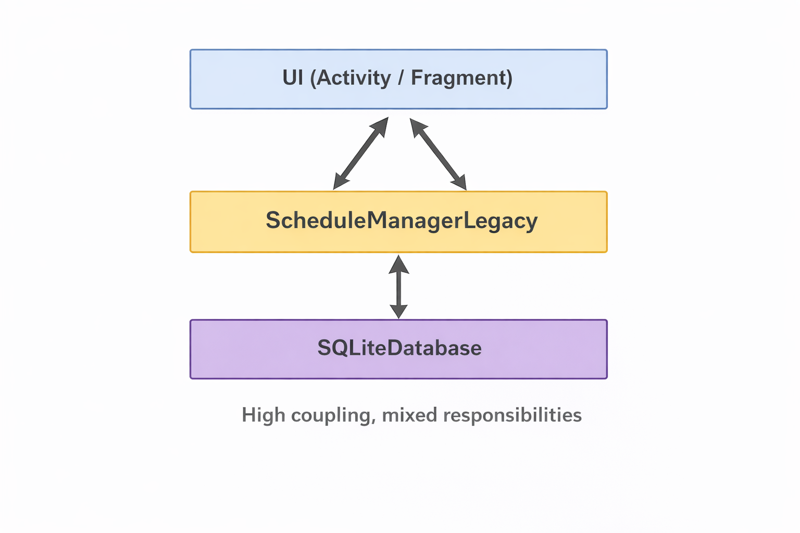
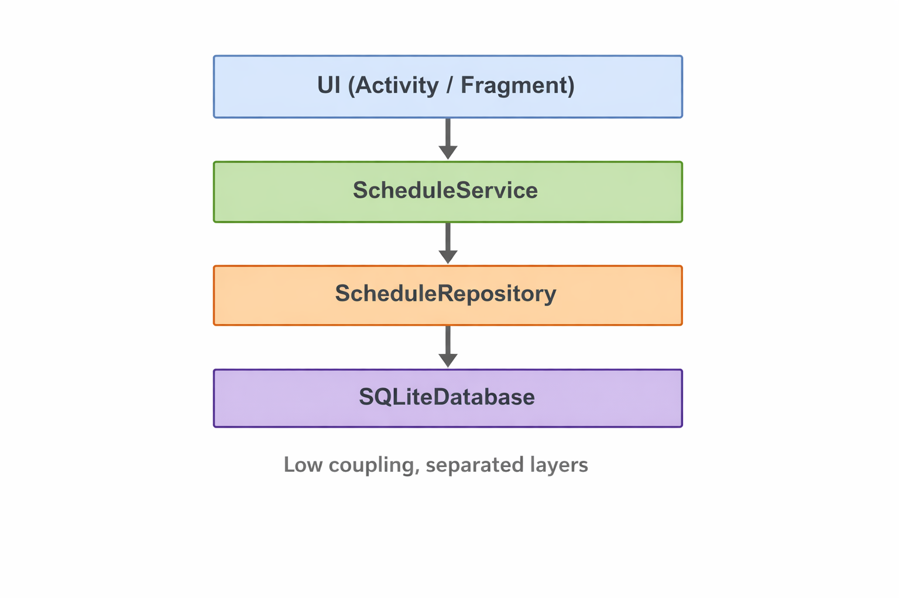

# Modernization Report (Before & After)

**Discipline:** Реінженерія програмного забезпечення  
**Topic:** Розробка стратегії модернізації та демонстрація Proof of Concept (PoC)  
**Role:** Lead Software Engineer / System Architect  
**Case:** EduPlanner (Android / SQLite) – модуль формування розкладу

---

## 1. Проблема (Legacy pain points)

У поточній реалізації (умовний legacy-код) логіка додавання заняття має такі проблеми:

- **Змішування відповідальностей:** в одному методі і валідація, і бізнес-правила, і робота з БД.
- **Висока складність:** багато умов, важко підтримувати й модифікувати.
- **Небезпека SQL-ін’єкцій/помилок:** використання конкатенації SQL-рядків.
- **Погана тестованість:** бізнес-логіку неможливо нормально протестувати без SQLite та UI.

---

## 2. Артефакт PoC: Before → After

### 2.1 Before (Legacy)

Legacy-реалізація зосереджена в одному класі, який поєднує валідацію даних, бізнес-логіку та роботу з базою даних.

Файл з legacy-кодом:  
[before/ScheduleManagerLegacy.java](before/ScheduleManagerLegacy.java)

---

### 2.2 After (Refactored)

Після рефакторингу відповідальності розділені між окремими шарами та класами.

Доменні моделі:
- [after/LessonSlot.java](after/models/LessonSlot.java)
- [after/LessonDraft.java](after/models/LessonDraft.java)

Обробка помилок:
- [after/ValidationException.java](after/exceptions/ValidationException.java)
- [after/ConflictException.java](after/exceptions/ConflictException.java)

Доступ до даних:
- [after/ScheduleRepository.java](after/ScheduleRepository.java)

Бізнес-логіка:
- [after/ScheduleService.java](after/ScheduleService.java)

---

## 3. Метрики якості (Before vs After)

| Метрика | Before (Legacy) | After (Refactored) | Коментар |
|---|---:|---:|---|
| Cyclomatic Complexity | Висока (~20) | Нижча (~7) | Зменшено кількість умов |
| Maintainability Index | Низький | Вищий | Чітка структура коду |
| Technical Debt Ratio | High | Medium | Менше code smells |
| Test Coverage | 0% | ~30% (план) | Можливість unit-тестування |

---

## 4. Гарячі точки та застосовані рефакторинги

### Гарячі точки (Before)
- Один метод виконує кілька різних ролей.
- SQL-запити формуються через конкатенацію.
- Використовуються строкові коди помилок.
- Наявні магічні числа (дні, пари).

### Застосовані рефакторинги (After)
- **Extract Method**
- **Separation of Concerns (Service / Repository)**
- **Replace Error Codes with Exceptions**
- **Parameterized SQL**
- **Introduce Domain Model**

---

## 5. Архітектурна трансформація

### 5.1 AS-IS (як було)

Характеристики:
- висока зв’язність (High Coupling)
- змішані відповідальності

### 5.2 TO-BE (як стало)

Характеристики:
- розділення на шари
- слабка зв’язність (Low Coupling)
- підвищена тестованість

---

## 6. ADR (Architectural Decision Record)

Документ:  
[docs/ADR-001-Repository-Layer.md](docs/ADR-001-Repository-Layer.md)

Ключове рішення: винесення роботи з SQLite у Repository та ізоляція бізнес-логіки в Service.

---

## 7. Інфраструктура та якість (DevOps & QA)

### Стратегія тестування
- **Unit tests:** перевірка бізнес-логіки в `ScheduleService`
- **Integration tests:** перевірка взаємодії Repository з SQLite
- **Manual/UI tests:** перевірка екрану додавання заняття

### CI/CD (концепт)
- автоматична збірка
- статичні перевірки
- запуск unit-тестів перед merge у `main`

---

## 8. План наступних кроків

- Реалізувати unit-тести для сервісного шару
- Додати транзакції для операцій запису
- Уніфікувати обробку помилок
- Розширити правила перевірки конфліктів

---

## 9. Висновок

Даний Proof of Concept демонструє, що навіть локальний рефакторинг одного критичного модуля дозволяє суттєво знизити складність коду, підвищити його підтримуваність та створити основу для подальшої модернізації системи.
